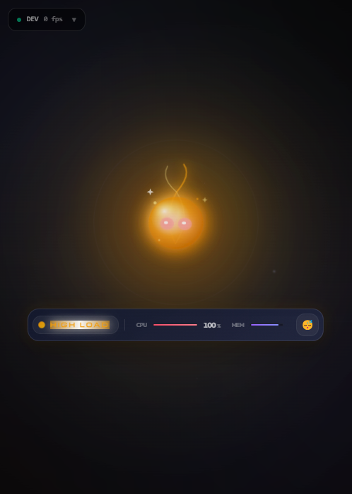

# ✨ Ethereal (以太之灵)

[](https://opensource.org/licenses/MIT)
[](https://github.com/pplmx/ethereal)
[](https://github.com/pplmx/ethereal)
[](https://github.com/pplmx/ethereal/actions/workflows/ci.yml)

**Ethereal** is a high-fidelity "Digital Spirit" desktop companion that lives on your screen, monitors your system's pulse, and responds with dynamic behaviors. Built with **Tauri 2.0**, **Rust**, and **React 19**, it blends system awareness with local AI intelligence.



## 🌟 Core Features

- **Digital Spirit Aesthetic**: A frameless, transparent, and glassmorphic UI with glowing auras and fluid floating animations.
- **System Perception**: Real-time monitoring of CPU, Memory pressure, Network speeds, Disk I/O, and Battery status.
- **Contextual Intelligence**: Powered by **Ollama**, the spirit "sees" what you're doing (Coding, Gaming, Browsing) and responds to clipboard content (code snippets, errors) with witty advice.
- **Conversation Memory**: Remembers your last few exchanges for a more natural interaction flow.
- **Interactive Presence**: Toggle click-through mode with `Ctrl+Shift+E`, drag it anywhere, or switch displays via a multi-monitor aware settings system.
- **Custom Appearance**: Personalize your spirit by dragging and dropping a folder of SVG/PNG sprites directly onto the window.
- **Robust Onboarding**: A welcoming guide for first-time users to help "awaken" and configure their spirit.

## 🎭 Dynamic States & Moods

The spirit evolves based on your activity:

1. **States**: `IDLE`, `WORKING` (Coding), `GAMING`, `BROWSING`, `OVERHEATING`, `HIGH_LOAD`, `THINKING`.
2. **Moods**: `Happy`, `Excited`, `Tired`, `Bored`, `Angry`.
3. **Visual Feedback**: Aura colors and animation speeds change dynamically to reflect the spirit's internal state.

## 🛠️ Requirements

- **OS**: Windows 10/11 (primary support).
- **Backend**: [Rust](https://www.rust-lang.org/tools/install).
- **Frontend**: [Node.js](https://nodejs.org/) & [pnpm](https://pnpm.io/installation).
- **AI**: [Ollama](https://ollama.com/) (installed and running with `llama3.2` model recommended).

## 🚀 Getting Started

1. **Clone & Install**:

    ```bash
    git clone https://github.com/pplmx/ethereal.git
    cd ethereal
    pnpm install
    ```

2. **Run in Development**:

    ```bash
    pnpm tauri dev
    ```

3. **Build Installation Package**:

    ```bash
    pnpm tauri build
    ```

## 🎮 Controls

- **`Ctrl+Shift+E`**: Toggle Click-Through mode (Ghost mode).
- **`Ctrl+Shift+Q`**: Quit the application safely.
- **Drag**: Move the window (when not in click-through mode).
- **Double-Click**: Quickly trigger AI chat or open settings (configurable).
- **Right-Click**: Access the native context menu for settings and display management.

## 📖 Documentation

- [User Guide](docs/usage.md) - How to interact and customize.
- [Technical Docs](docs/technical.md) - Architecture and implementation details.
- [Roadmap](docs/roadmap.md) - Project vision and future goals.
- [Development Plan](ROADMAP.md) - Detailed technical implementation roadmap.
- [Contributing](CONTRIBUTING.md) - Guidelines for contributors.

## 📜 License

This project is licensed under the MIT License - see the [LICENSE](LICENSE) file for details.

## 🙏 Acknowledgments

- **Tauri Team** for the cross-platform framework.
- **Ollama** for bringing local LLMs to everyone.
- **Framer Motion** for the buttery-smooth animations.
